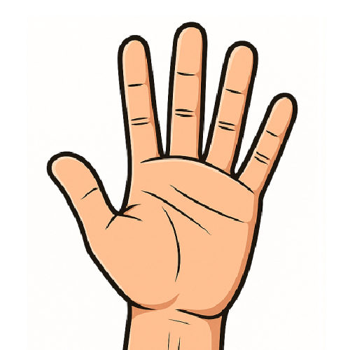
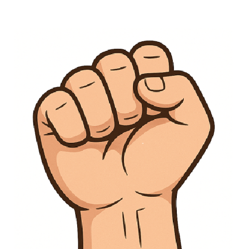
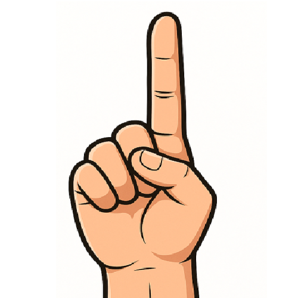
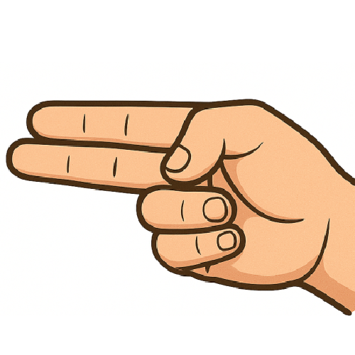

# GestureBoard [](README.md)
GestureBoard is an innovative application that allows you to assign computer operations to your hand gestures through an intuitive graphical user interface.

Gesture recognition and hand position learning is powered by neural networks, implemented by [<i>Google MediaPipe</i>](https://ai.google.dev/edge/mediapipe/solutions/vision/gesture_recognizer).


## Running the Application
The client can be run using the executables found in the release versions, or by directly running main.py located in the <i>App</i> folder.


## Basic Gestures
<div align="center">


| **Open palm** | **Closed fist** | **Pointing up** | **Two fingers left** |
|:-------------------:|:------------------:|:-------------------:|:------------------:|
|  |  |  |  |


</div>

## Training Custom Gestures
If you want to replace or expand the 4 basic gestures, you'll need a training server during the training process. You can create your own server, specify an existing server, or use the cloud-based training server provided by GestureBoard.

When using cloud-based training, the training process may take up to 1-2 minutes.

> **Privacy**  
> During the training phase, GestureBoard takes photos of the user's hands. These images are only needed during training and are not shared with third parties in any form.
>
> Use the software on your own risk. Please ensure that the images do not contain any sensitive data, personal information, or content that could pose privacy or security risks.


### Creating a Training Server
The training server can be easily created and started using [<i>Docker</i>](https://www.docker.com/). After installing Docker, navigate to the project's <i>docker</i> folder and run the following commands:

```bash
docker compose build
docker compose up -d
```

## Tips
<details>
  <summary>Click to expand/collapse</summary>

- <i>GestureBoard</i> works best when you hold your hand relaxed.

- Before use, try out the gestures in the camera settings! You'll see on the camera view how the program detects your hand and what gestures it recognizes.

- The program will recognize your own gesturers most accurately and precisely.

- Try to choose hand positions where your fingers don't cover each other, or only minimally! If the program isn't accurate enough after training, it's recommended to run the training process again and re-recording the samples if necessary.
</details>


## Requirements
The software requires the latest Microsoft C++ Redistributable to be installed.

If you don't want to run the program from the prepared executable file, the Python dependencies can be installed with the following commands:
```bash
pip install -r requirements.txt
```

## Credits to Icon Creators
<details>
  <summary>Click to expand/collapse</summary>
<br>

GestureBoard uses free icons from [flaticon](flaticon.com). Thanks to the following creators:
- joalfa - [Console icon](https://www.flaticon.com/free-icons/command)
- juicy_fish - [Keyboard icon](https://www.flaticon.com/free-icons/hardware)
- Creative Avenue - [Selectable actions icon](https://www.flaticon.com/free-icons/widget)
- berkahicon - [Hand icon](https://www.flaticon.com/free-icons/cursor)
- Dixit Lakhani_02 - [Checkmark](https://www.flaticon.com/free-icons/tick)

- Good Ware - [Camera icon](https://www.flaticon.com/free-icons/camera)

</details>